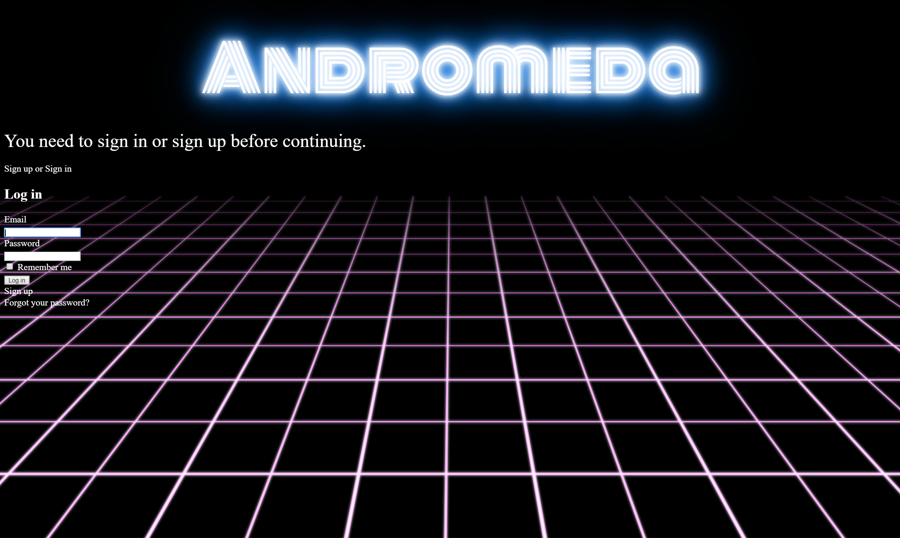
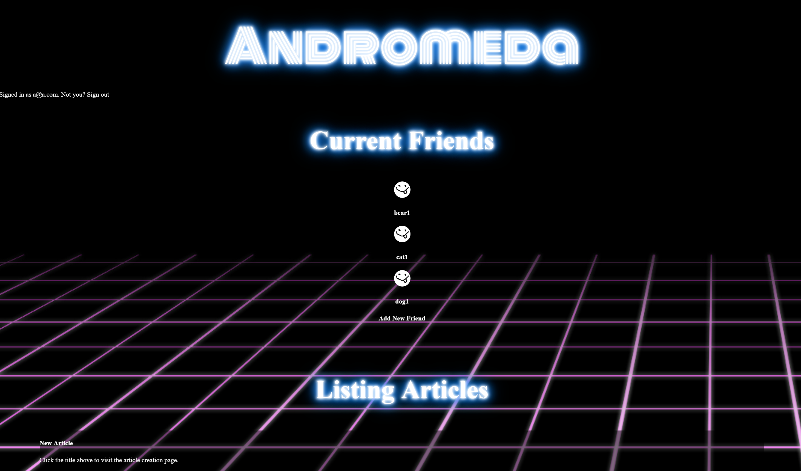
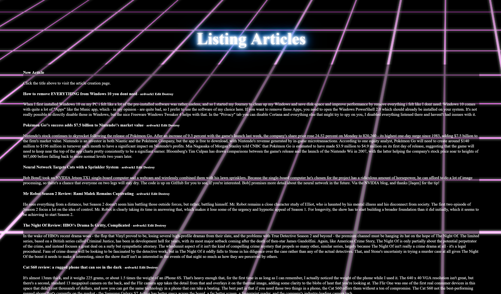
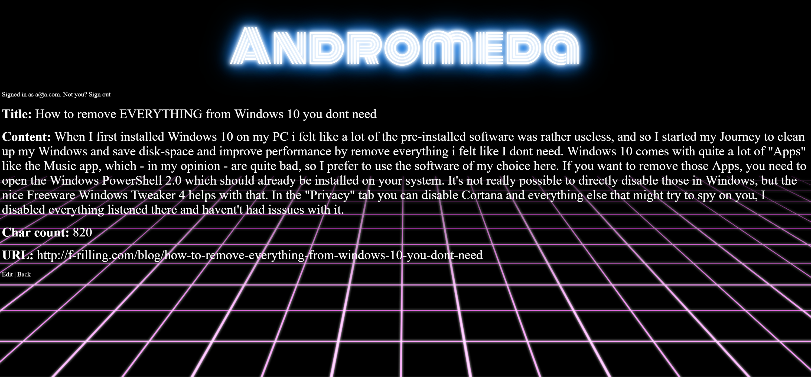
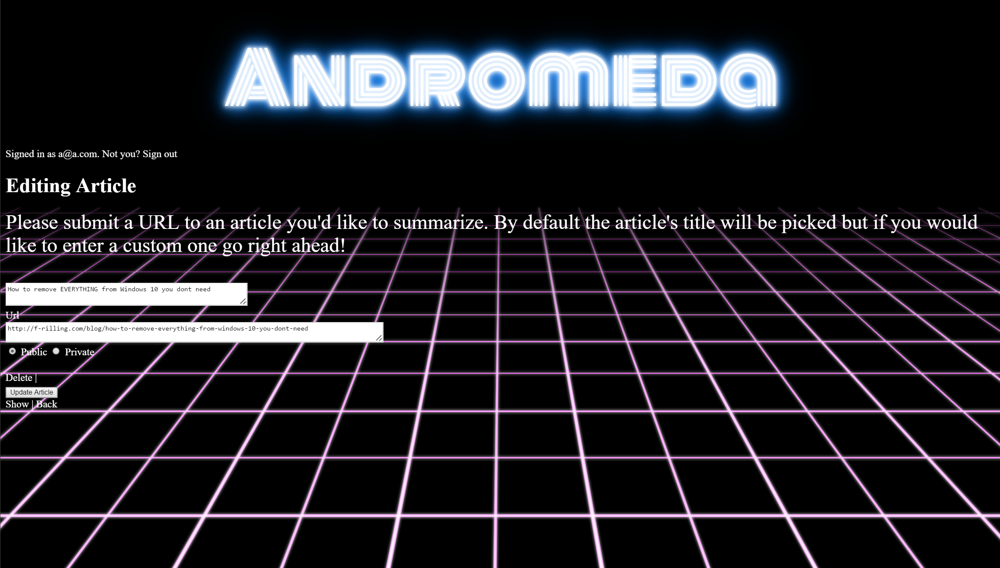
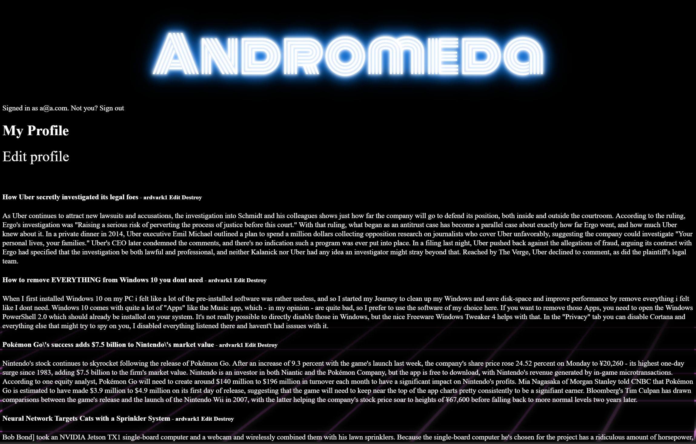
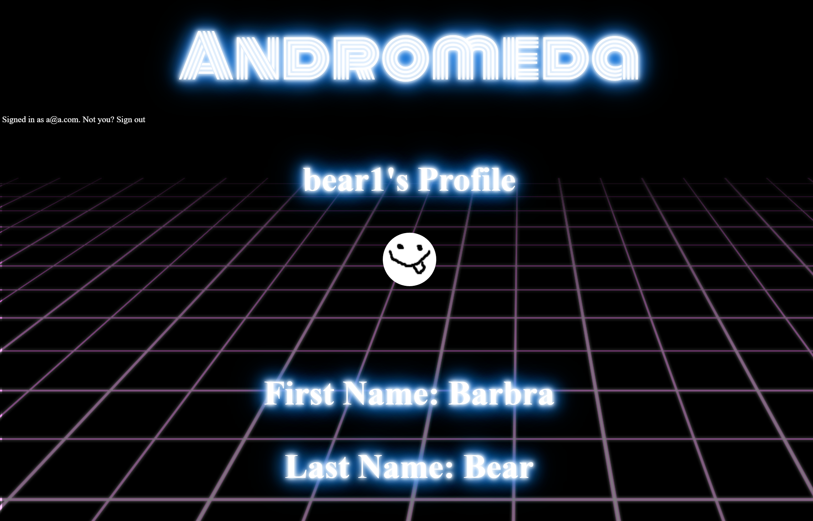

# Andromeda
This is a social article summary sharing application built on rails. It allows a signed-in user to upload a url to an article they'd like summarized and, if they choose to make it public, have it posted for all of their friends to see.  You can also view other friend profile pages.

This is the main sign-in page for the app.  You must be signed in to use any part of the site.

The main homepage for the app, showing the user's current friends

The bottom of the homepage shows the articles that have been uploaded by either themself or their friends along with the section to add a new one.

This is the show page for an article.  Clicking on the URL sends you to the original article.

This is the edit page for an article.

This is the user's profile page, showing all of their submitted articleswhether they are private or not.

This is the user's profile page, showing all of their submitted articleswhether they are private or not.  When a user is signed up they are assigned a default profile picture.
